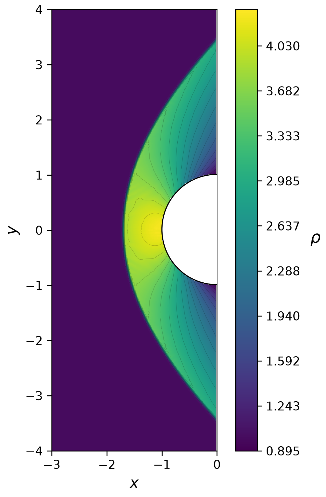
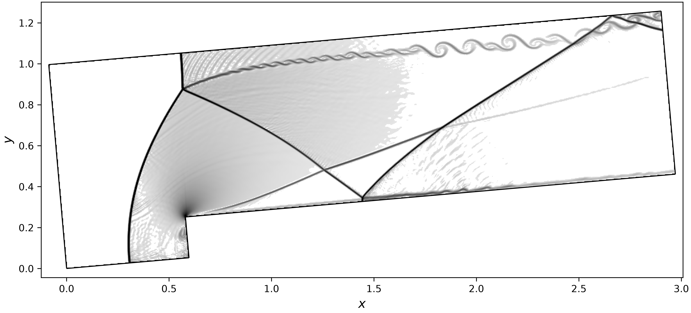

# 2D Three-Temperature Radiation Hydrodynamics WENO Solver

A Rust implementation of a two-dimensional, high-order finite-difference solver for the three-temperature radiation hydrodynamics (3-T RH) system on Cartesian grids with arbitrary polygon-embedded geometries.

The implementation follows the 2D algorithm described by J. Cheng and C.-W. Shu in *High order conservative finite difference WENO scheme for three-temperature radiation hydrodynamics* (Journal of Computational Physics, 2024). The boundary treatment follows the high-order inverse Lax–Wendroff (ILW) / WENO extrapolation approach of S. Tan, C. Wang, C.-W. Shu, and J. Ning in *Efficient implementation of high order inverse Lax–Wendroff boundary treatment for conservation laws* (Journal of Computational Physics, 2012).

## What this code solves

The model contains six evolved quantities in two spatial dimensions:

- density `rho`
- x-momentum `mom_x`
- y-momentum `mom_y`
- electron energy variable `ee`
- ion energy variable `ei`
- radiation energy variable `er`

The paper writes the 2D system in the form

```text
U_t + dF1/dx + dF2/dy
    - (u/3) dN/dx - (v/3) dN/dy
  = dG1/dx + dG2/dy + S
```

where `F1` and `F2` are the conservative convection fluxes, `N` contains the non-conservative pressure combinations, `G1` and `G2` are the electron/ion/radiation diffusion fluxes, and `S` contains the electron-ion and electron-radiation energy exchange terms.

This is the same operator structure assembled in `l()` in `main.rs`: conservative x/y flux divergences, non-conservative x/y contributions, source terms, and diffusion in both directions are combined to form the semi-discrete right-hand side.

## Simulation Results

### Mach 3 flow past a circular cylinder

<p align="center">
  
</p>

<p align="center">
  <em>
    Density field for Mach 3 flow past a circular cylinder.
  </em>
</p>

### Rotated forward-facing step

<p align="center">
  
</p>

<p align="center">
  <em>
    Numerical schlieren for Mach 3 flow over a forward-facing step
    rotated 5° relative to the Cartesian grid.
  </em>
</p>

## Numerical method

The spatial discretization is a fifth-order finite-difference WENO scheme with local characteristic decomposition (Roe-averaged 6x6 eigen-decomposition per interface, `weno.rs`), following the 2D construction in Section 4 of the reference paper.

The main algorithm is:

1. Recompute all ghost-cell values for the current RK stage (`GhostGrid`).
2. Build x-direction WENO interface fluxes (characteristic space).
3. Build y-direction WENO interface fluxes.
4. Add the non-conservative x/y terms (6th-order central derivative + upwind jump terms, `noncon.rs`).
5. Add the source term (`source.rs`).
6. Add the diffusion contribution in x/y (`diffusion.rs`).
7. Advance the solution with third-order SSP Runge-Kutta time integration.

The paper explicitly notes that the 2D finite-difference method can reuse the 1D algorithm independently in each coordinate direction. This project follows that structure: the WENO reconstruction is called once for x-directed stencils and once for y-directed stencils.

### Grid-aligned shock instability cure

To suppress the carbuncle-type instability that appears when a shock aligns with the grid lines, the flux splitting in `reconstruction_fast()` (`weno.rs`) uses a low-dissipation wave-speed estimate following Fleischmann, Adami, Hu and Adams (2020) instead of the Roe-averaged eigenvalues:

- For each acoustic wave the local sound speed is capped by the normal velocity magnitude: `cs_i = min(PHI * |u_i|, cs_i)` on each side of the interface.
- The interface wave speeds are then `a_k = max(|u_L - cs_L|, |u_R - cs_R|)` for the left-running acoustic wave and `a_k = max(|u_L + cs_L|, |u_R + cs_R|)` for the right-running one; the four linearly-degenerate waves use `max(|u_L|, |u_R|)`.
- The capped sound speed reduces the numerical dissipation of acoustic waves near grid-aligned shocks while retaining upwinding robustness; `PHI = 5.0` is set in `constant.rs`. 

## Time integration

Time advancement uses the three-stage, third-order SSP Runge-Kutta method from the paper:

```text
u1 = u^n + dt L(u^n)

u2 = 3/4 u^n + 1/4 u1 + dt/4 L(u1)

u^(n+1) = 1/3 u^n + 2/3 u2 + 2 dt/3 L(u2)
```

In the code this is implemented in `rk3_ssp()`.

The global time step is `dt = 0.8 * dt_cfl`, where `dt_cfl` is the minimum over all fluid cells of `dt::get_local_dt()` (which includes advection, diffusion and exchange-term eigenvalue estimates, scaled by `LAMBDA = 0.5`). The step is clipped so the simulation lands exactly on output times and `t_final`.

## Geometry and boundary conditions

The **single source of boundary definition** is the list of analytic
`BoundaryElement`s on the `Field` (`outer_boundary` / `inner_boundary`),
each combining ONE analytic geometry — `LineSegment`, `CircularArc` or
`Circle` — with ONE `BCType`. Initializers pass these straight to
`Field::from_boundaries(...)`.

The classifier polygons and the fluid mask are **derived** from those
elements at construction time (`geometry::polygonize_boundary` samples the
analytic curves into closed classifier rings). The derived polygons are
stored on the `Field` only to answer "is this Cartesian point fluid / which
side is this ghost on?":

- `outer_bound`: derived polygon with fluid inside (`FluidSide::Inside`).
- `inner_bound`: optional derived polygon with fluid outside
  (`FluidSide::Outside`); `None` when there is no inner obstacle.

A Cartesian point is fluid if and only if it lies inside the outer
classifier and outside any inner classifier (`Field::is_in_domain`);
otherwise it is treated as a ghost cell. Because the polygons are derived,
initializers never describe a boundary twice, and the legacy per-polygon-side
`bc_outer` / `bc_inner` BC lists have been removed.

### Ghost grid

`ghost.rs` discovers, once at startup, every ghost index referenced by the solver stencils (a radius-4 cross, `default_stencil_offsets()`, covering WENO, non-conservative and diffusion stencils), and caches for each ghost:

- its analytic physical `BoundaryElement` (`find_boundary_element` returns the closest element, geometric ties broken by BC priority),
- the analytic projection to the closest boundary point `P0` and the outward fluid normal,
- the signed normal distance from `P0` to the ghost point,
- precomputed WENO-extrapolation data for the ghosts that need it (Wall / Outflow / FarField ghosts).

Ghost values are recomputed in parallel (Rayon) once per RK stage in `GhostGrid::update_values_parallel()`. All ghosts are first-stage-independent, so the update is data-parallel.

### Boundary conditions (`bc1.rs`)

| BCType | Description |
|---|---|
| `Wall` | High-order ILW: no-penetration constraint on the momentum row, characteristic WENO extrapolation for the other rows, 4th-order Taylor expansion to the ghost point. |
| `ReflectiveWall` | Geometric reflection of the nearest interior state with normal momentum flipped. |
| `FarField(state)` | Characteristic BC: outgoing characteristics from WENO extrapolation, incoming characteristics from the freestream state. Becomes supersonic inflow/outflow automatically. |
| `NonReflectiveOutflow` | Non-reflecting outlet: outgoing characteristics extrapolated, incoming set to zero. Uses the same precomputed `GhostBC` fast path as `FarField`/`Outflow`. |
| `Outflow { p_inf, sigma, l_domain }` | LODI pressure relaxation for the incoming acoustic wave. |
| `Constant(state)` / `TimeDependent(f)` | Prescribed boundary state. |
| `ZerothOrder` | Ghost value copied from the mirrored interior cell. |
| `Periodic` | Periodic wrap along the grid axis the ghost leaves the domain on: left/right sides wrap the x index, top/bottom sides wrap the y index (used by the translating-shock test). |

The high-order machinery (`weno_extrapolation()`) follows Tan, Wang, Shu, and Ning (2012), Sec. 2.4: for each order r = 0..4 a 2D polynomial of degree r is least-squares fitted to the (r+1)^2-point stencil `E_r` of characteristic variables in boundary-normal coordinates; smoothness indicators and nonlinear weights select the WENO combination of the k-th normal derivatives, which are Taylor-expanded to the ghost point.

## Current test problem in `main.rs`

The current executable is the **Mach-3 flow past the front half of a circular cylinder** (`init::init_cylinder()`):

```text
domain      : x in [-3, 0], y in [-6, 6]
obstacle    : half-disk x^2 + y^2 < 1, x <= 0  (part of the outer polygon)
grid        : nx = 121, ny = 481, dx = dy = 1/40
freestream  : rho = 1, p = 1, M = 3  (splits: ee = ei = er)
t_final     : 10.0
output      : every dt_store = 0.05
dt          : 0.8 * dt_cfl
```

The cylinder wall is a single analytic `CircularArc` boundary element with the high-order ILW `Wall` BC; the 360 polygon segments that approximate the arc remain only as the domain classifier / fluid mask. All outer straight sides use `FarField` (the left side `x = -3` is supersonic inflow).

Other initializers in `init.rs` include `init_shock_cylinder_in_box(wall)` (the full cylinder inside a rectangular box, with `CylinderWallMode::{Reflective, HighOrder, Primitive}`), `init_rotated_shock_cylinder(wall)`, `init_planar_shock_channel()`, `init_forward_facing_step_rotated()`, and `init_double_mach()` (the paper's double-Mach-reflection benchmark).

## Project layout

```text
.
└── src/
    ├── main.rs          grid/driver setup, spatial operator l(), SSP-RK3, time loop, output
    ├── state.rs         State representation, pressure splits, physical fluxes, arithmetic
    ├── weno.rs          WENO stencil, Roe-average eigen-decomposition, characteristic WENO5 reconstruction
    ├── noncon.rs        non-conservative pressure term (6th-order derivative + upwind jumps)
    ├── diffusion.rs     diffusion flux (6-point derivative of temperature)
    ├── source.rs        electron-ion / electron-radiation energy exchange
    ├── dt.rs            local time-step estimate
    ├── constant.rs      physical and numerical constants
    ├── geometry.rs      points, vectors, projections, polygons, analytic boundaries (line/arc/circle)
    ├── field1.rs        GridInfo + Field with polygon-defined fluid region and analytic boundary elements
    ├── ghost.rs         GhostGrid: static ghost layout, parallel per-stage updates
    ├── bc1.rs           boundary conditions (ILW wall, WENO extrapolation, far-field, LODI, ...)
    ├── init.rs          initial conditions (cylinder, shock-cylinder-in-box, double Mach reflection, ...)
    ├── io.rs            binary output/restart writer and reader
    └── monitor.rs       per-step diagnostics / RHS residual norms -> data/monitor.csv
```

`bc.rs` and `field.rs` are legacy rectangular-grid variants that are no longer wired into the build (`main.rs` declares `bc1`/`field1` instead).

## Build and run

```bash
cargo build --release
```

Fresh run (clears `data/`):

```bash
cargo run --release
```

Restart from an existing snapshot, e.g. `data/solution_0012.bin`:

```bash
cargo run --release -- 12
```

The run prints the grid summary, per-step time/time-step info, periodic wall-boundary statistics, and output-file writes. Each step also appends one diagnostics line to `data/monitor.csv` (see [Output](#output)).

## Tests

```bash
cargo test
```

Test coverage includes:

- WENO (`weno.rs`): eigen-decomposition (`L * R = I` for x/y), characteristic round-trip, constant-state flux preservation, WENO5 convergence order on a smooth profile.
- noncon (`noncon.rs`): constant-state and zero-velocity vanishing, direction sensitivity, wrapper consistency.
- bc1 (`bc1.rs`): polynomial least-squares reproduction, derivative extraction, paper stencil `E_r` cardinality/structure on vertical and horizontal walls, constant-state characteristic extrapolation and final ghost reconstruction, ILW wall robustness and analytic-element BC resolution at junctions.
- geometry (`geometry.rs`): analytic line/arc/circle projection and polygon classification.
- ghost (`ghost.rs`): stencil-offset bookkeeping.
- state (`state.rs`): primitive-to-conservative conversion.
- monitor (`monitor.rs`): residual-norm formulas (R1/R2/Rinf), NaN-cell skipping, missing-RHS behaviour and the CSV header column layout.
- `main.rs` (`parity` module): analytic cylinder-circle geometry and ghost projections, mirror symmetry after an RK step, and initial/admissibility checks of the primitive and high-order walls.

## Output

Binary files `data/solution_NNNN.bin` (little endian):

```text
header:
  [8]u8  magic = "RH3TBIN1"
  u32    version = 1
  u32    nvar = 8
  u64    nx
  u64    ny
  f64    time

payload, j-major (x fastest):
  repeated nx*ny times: f64 x, y, rho, mom_x, mom_y, ee, ei, er
```

Points outside the fluid polygon are stored as NaN so post-processing can mask them. Files are written to a `.tmp` name and atomically renamed, so a live visualizer never sees a partial file.

### Per-step diagnostics (`monitor.rs`)

Every step appends one line to `data/monitor.csv` (fresh runs truncate and rewrite the header; restarts append):

- step/time/`dt`/`dt_cfl`/`dt_over_dt_cfl` and the number of fluid cells,
- physical-health extrema (`rho`, total pressure `p`, the partial pressures `pe/pi/pr`, the internal energies `ee/ei/er`, max speed and Mach),
- global integrals (mass, `mom_x`, `mom_y`, total energy),
- temporal activity `||(U^{n+1} - U^n)/dt||_RMS` for the six conservative components,
- spatial oscillation indicators (total variation `tv_rho`/`tv_p`, second-difference `s2_rho`/`s2_p`),
- semi-discrete RHS residual norms of `dU/dt = RHS(U)`: for each conservative component (`rho`, `mom_x`, `mom_y`, `e_e`, `e_i`, `e_r`) the `R1` (mean absolute), `R2` (RMS) and `R_inf` (max absolute) norms over the valid fluid cells (columns `<component>_R1/_R2/_Rinf`).

The residual is the actual RHS evaluated at the step-start state (the first RK3-SSP stage), never a time-step difference or time-integration error.

### Visualization

Interactive snapshot viewer (arrow keys step through frames, `q` quits; safe to run while the solver is still writing). It reads the same `data/solution_*.bin` format through the shared reader `py_utils/solution_io.py`:

```bash
python visualize_sol.py
```

Real-time single-window dashboard (5 pages: `1 Solution | 2 Health | 3 Activity | 4 Oscillation | 5 Global`), combining `data/solution_*.bin` with the live `data/monitor.csv`:

```bash
python scripts/live_monitor.py          # GUI
python scripts/live_monitor.py --no-gui # headless, writes dashboard.png
```

The Activity page shows the semi-discrete RHS residual history: per-component `R1 / R2 / R_inf`, either raw or normalized by each component's own first-row reference (`R(t)/R(t_ref)`, so the first point is 1), on a logarithmic scale; the norm / raw / normalized choice is made with the radio on the page. Historical `monitor.csv` files written before the residual columns existed are still accepted (the page falls back to the temporal-activity view).

Other helper scripts:

- `py_utils/contour_gen.py` — contour plots of a single snapshot (edit the gamma values to match `constant.rs`).
- `py_utils/solution_io.py` — shared binary reader used by `visualize_sol.py` and `scripts/live_monitor.py`.
- `energy_split.py` — history of the maximum electron/ion/radiation energy splits across snapshots; writes `energy_split_history.csv`.
- `conservation_check.py` — legacy text-format (`*.dat`) conservation check.

## Current physical parameters (`constant.rs`)

```text
DEFAULT_EPS = 1e-12
KAPPA_E = KAPPA_I = KAPPA_R = 0   (no diffusion)
OMEGA_EI = OMEGA_ER = 0           (no energy exchange)
CVE = CVI = 1, A = 1
GAMMA_E = GAMMA_I = GAMMA_R = 1.4
LAMBDA = 0.5, WENO_Q = 10.0, PHI = 5.0
```

With these settings the code reduces to the 3-T Euler equations; diffusion and exchange terms are in place but inactive.

## Accuracy and verification

The reference paper reports fifth-order spatial accuracy and third-order SSP Runge-Kutta time discretization for its finite-difference WENO construction.

Recommended verification workflow:

1. Verify constant-state preservation (`cargo test` covers this at the component level).
2. Reproduce the paper's 2D manufactured-solution test to measure `L1`/`Linf` convergence.
3. Check conservation of mass, momentum, and total energy for compatible boundary conditions.
4. Test the discontinuous shock-tube configuration.
5. Enable diffusion and energy exchange only after the non-diffusive case is verified.
6. Compare density and the three temperatures against a reference solution.

## Reference

> J. Cheng and C.-W. Shu, "High order conservative finite difference WENO scheme for three-temperature radiation hydrodynamics," *Journal of Computational Physics* 517 (2024), 113304.

The boundary treatment follows:

> S. Tan, C. Wang, C.-W. Shu, and J. Ning, "Efficient implementation of high order inverse Lax–Wendroff boundary treatment for conservation laws," *Journal of Computational Physics* 231 (2012), 2510–2527.

The grid-aligned shock instability cure follows:

> N. Fleischmann, S. Adami, X. Y. Hu, and N. A. Adams, "A low dissipation method to cure the grid-aligned shock instability," *Journal of Computational Physics* 401 (2020), 109004.

The positivity preserving follows: 
> X. Zhang and C.-W. Shu, "Positivity-preserving high order finite difference WENO schemes for compressible Euler equations," Journal of Computational Physics 231 (2012), 2245–2258.